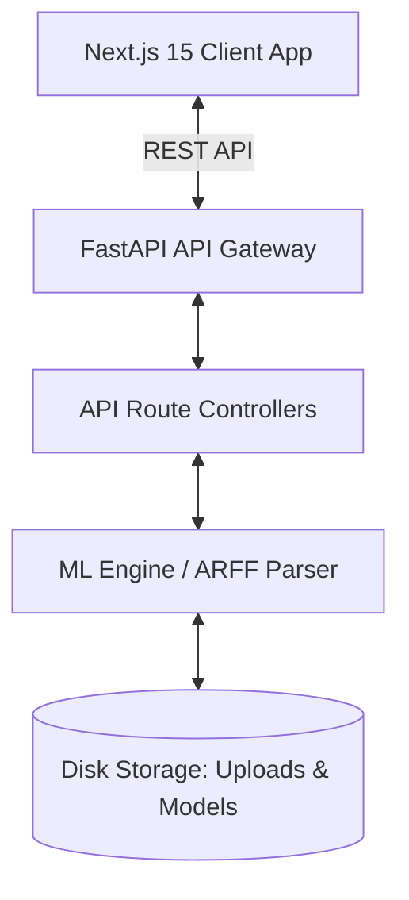
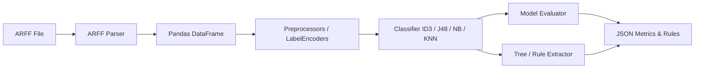

# DataMine AI Classifier - System Architecture

This document describes the high-level system design, directory layout decisions, ML execution pipelines, and data flow specifications for the **DataMine AI Classifier** application.

---

## 1. High-Level Design

The application is structured as a decoupled Single Page Application (SPA) client interacting with a stateless REST API backend:

### Key Decisions
- **Next.js 15 (App Router)**: Utilizing React Server Components (RSC) for initial layouts, and Client Components (`"use client"`) for rich interactive interfaces like the tree rendering and charts.
- **FastAPI**: Provides high-performance, asynchronous endpoints with automated OpenAPI generation and strong type checking using Pydantic.
- **REST API Communication**: JSON payloads represent configurations, metrics, and chart data, while file upload endpoints handle the `.arff` parsing stream.
- **Decoupled State**: The backend does not maintain active sessions. Uploaded files and trained models are stored on disk / memory and identified by session/task IDs.

---

## 2. Machine Learning Pipeline Architecture

The machine learning component is designed to be highly modular, supporting custom classifiers alongside standard scikit-learn algorithms.

### Component Details:
1. **ARFF Parser**: Built using `liac-arff` library. Converts relations, attribute definitions, and data blocks into structural metadata and tabular Pandas DataFrames.
2. **ID3 & J48 (C4.5)**: 
   - Since scikit-learn does not provide standard implementations for pure ID3 or pruned J48/C4.5 decision trees (its DecisionTreeClassifier uses an optimized CART algorithm), the ML package has dedicated skeletons to implement or wrap these algorithms.
   - Outputs include the decision structure as a tree graph and as a text list of IF-THEN rules.
3. **Naive Bayes & KNN**: Implemented using scikit-learn's standard `GaussianNB` / `CategoricalNB` and `KNeighborsClassifier`.
4. **Tree Visualizer**: Outputs standard Graphviz DOT formatting representing the decision tree, which is converted to a node/edge JSON structure suited for `@xyflow/react` (React Flow) rendering.

---

## 3. API Contract Specifications

The API communicates exclusively via standard HTTP methods and JSON formats.

### Endpoints:
- `POST /api/v1/dataset/upload`
  - Uploads a `.arff` file.
  - Returns a unique dataset ID, attribute summary (names, types), and class label candidates.
- `POST /api/v1/classify/train`
  - Trains a selected classifier (ID3, J48, Naive Bayes, KNN) with configurable hyper-parameters.
  - Returns:
    - Model ID
    - Evaluation metrics (Accuracy, Precision, Recall, F1, Confusion Matrix)
    - Extracted IF-THEN rules
    - Decision Tree representation (for React Flow render)
- `POST /api/v1/compare`
  - Trains all 4 algorithms concurrently on the selected dataset split.
  - Returns comparative performance data (metrics comparison, train/predict durations) formatted for Chart.js display.
- `POST /api/v1/export`
  - Generates a downloadable PDF or JSON report containing model details, performance graphs, and rules.

---

## 4. Security & Performance Considerations

- **Upload Sanitization**: Uploaded `.arff` files are size-limited and parsed inside validation schemas before memory storage to prevent path-traversal or denial-of-service.
- **Model Storage**: Trained models are serialized using `joblib` / `pickle` inside `backend/app/storage/models/` for quick reloading without retraining, with automated cleanup routines.
- **Asset Visuals**: Large trees use dynamic layout calculations (e.g., hierarchical graphviz layouts on the backend, or React Flow layout algorithms on the frontend) to avoid UI lockup on high-dimension datasets.
